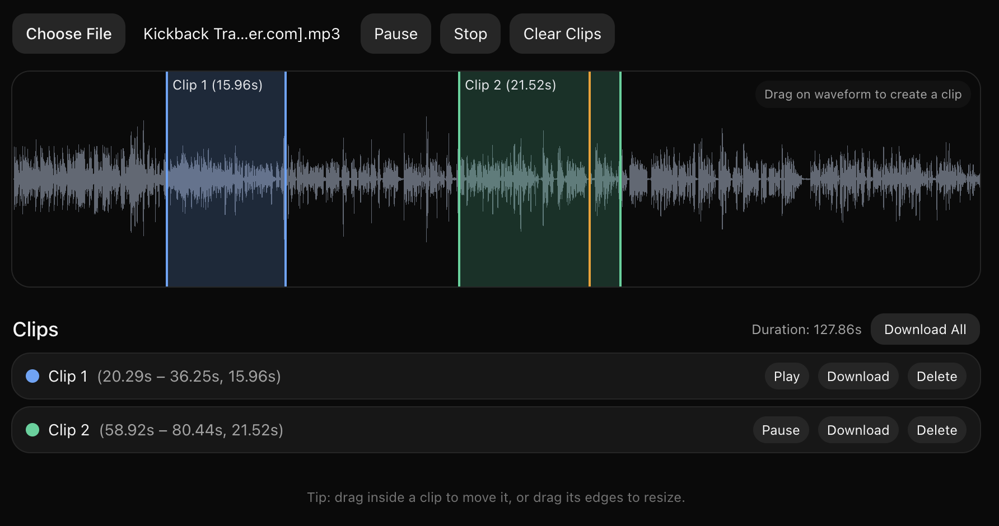

# Audio Cropper

Minimal, fast, and private in‑browser audio clipper. Upload any audio, mark clips on the waveform, preview them, and download as MP3 (individually or all-at-once as a ZIP).

👉 Live: https://audio-cropper.netlify.app



## Features
- Create, move, and resize clips directly on the waveform
- Global Play/Pause and per-clip Play/Pause, with an accurate playhead
- Single‑click seek anywhere on the waveform or inside a clip
- Export each clip to MP3 (preserves channels up to stereo, sensible bitrate)
- Download all clips at once as a ZIP archive
- Runs entirely in your browser (no uploads, no accounts, no tracking)

## How to use
1. Click “Choose File” and pick an audio file.
2. Drag across the waveform to create a clip.
3. Drag inside a clip to move it, or drag its edges to resize.
4. Use Play/Pause/Stop globally or per clip; the playhead shows the current position.
5. Click “Download” on any clip to export it as MP3, or “Download All” to get a ZIP of all clips.

## Run locally
This repo ships with a prebuilt Tailwind CSS file. You only need a static server.

```bash
git clone https://github.com/sabbah13/audio-cropper-js.git
cd audio-cropper-js
npm install
npm run build:css   # builds styles.css (optional if already present)
npx http-server .   # or any static server; open http://localhost:8080
```

## Contributing
Issues and pull requests are welcome!
- Keep code clear and readable.
- Avoid heavy dependencies; this app is purposely lightweight.
- Test playback controls, clip editing, and downloads across Chrome/Firefox/Safari.

## License
MIT — see `LICENSE` for details.


